# RegRAG
A Multi-Agent RAG platform using Vector DBs and AI models to accurately answer AML/FT compliance queries.
<div align="center">
  
  
  
  
  
  
  
  
  


</div>

<div align="center">
  
</div>

## Table of Contents
1. [Core Concepts](#core-concepts)
2. [The AML Use Case](#the-aml-use-case)
3. [Workflows](#workflows)
   - [Data Ingestion Pipeline](#data-ingestion-pipeline)
   - [RAG System Workflow](#rag-system-workflow)
4. [RAG System](#rag-system)
5. [Advanced Features](#advanced-features)
6. [Technology Stack](#technology-stack)
7. [Setup and Installation](#setup-and-installation)
8. [Running the Document Ingestion Pipeline](#running-the-document-ingestion-pipeline)
9. [Running the Complete System](#running-the-complete-system)
10. [Future Roadmap](#future-roadmap)

## Core Concepts

### What is a Vector Database?
A **Vector Database** is a specialized database designed to store, manage, and search high-dimensional vectors. In the context of AI, these vectors (also known as *"embeddings"*) are **numerical representations** of data like text, images, or audio.

Instead of searching for exact keywords, a vector database finds items based on their *semantic similarity*. For example, it understands that the phrases "money laundering prevention" and "anti-money laundering compliance" are conceptually related, even though they use different words.

### What is Retrieval-Augmented Generation (RAG)?
**Retrieval-Augmented Generation (RAG)** is an AI framework that enhances Large Language Models (LLMs) by providing them with external, up-to-date, and context-specific information.

Here's how it works:
1.  **Retrieve:** When a user asks a question, the system first searches a knowledge base (like our vector database of AML documents) to find relevant information.
2.  **Augment:** The retrieved information is then added to the user's original prompt.
3.  **Generate:** The LLM receives the augmented prompt (question + relevant context) and generates a context-aware answer.

RAG prevents LLM hallucinations and ensures that answers are grounded in factual, domain-specific data.

## The AML Use Case

### The Challenge in AML/FT Compliance
Financial institutions face a significant challenge in keeping up with Anti-Money Laundering (AML) and Counter-Financing of Terrorism (FT) regulations. These regulations are complex, vary by jurisdiction (e.g., USA, EU, Brazil), and are spread across numerous lengthy, dense legal documents. Manually searching for specific compliance requirements is slow, error-prone, and requires significant expertise.

### Our Solution
This project builds a RAG system to solve this problem. By converting a library of AML/FT regulations from different regions into a searchable vector database, we can create an AI agent that instantly retrieves the exact clauses and requirements needed to answer complex compliance queries, providing accurate, source-backed answers in seconds. This dramatically improves the efficiency and accuracy of compliance officers.

### Source Documents
The system is trained on a collection of AML/FT regulatory documents from **three major jurisdictions**:

#### 🇺🇸 **United States** (English)
- **USA PATRIOT Act** (`PLAW-107publ56.pdf`) - Public Law 107-56, Uniting and Strengthening America
- **Bank Secrecy Act Section 8** (`section8-1.pdf`) - BSA compliance requirements

#### 🇪🇺 **European Union** (English)
- **5th Anti-Money Laundering Directive** (`CELEX:32015L0849:EN:TXT.pdf`) - EU AML Directive 2015/849
- **6th Anti-Money Laundering Directive** (`CELEX:32018L0843:EN:TXT.pdf`) - EU AML Directive 2018/843
- **EU AML Package 2021** (`cellar:05758242-ead6-11eb-93a8-01aa75ed71a1.0001.02/DOC_1.pdf`) - Latest EU AML framework

#### 🇧🇷 **Brazil** (Portuguese)
- **Circular BCB 4001** (`C_Circ_4001_v2_P.pdf`) - Central Bank of Brazil AML/CFT regulations
- **Circular BCB 3978** (`Circ_3978_v3_P.pdf`) - Customer Due Diligence requirements

## Workflows

This project consists of two main workflows: the **Data Ingestion Pipeline** that processes and stores regulatory documents, and the **RAG System Workflow** that handles intelligent query processing.

### Data Ingestion Pipeline

The data ingestion pipeline processes raw regulatory documents and prepares them for the RAG system.

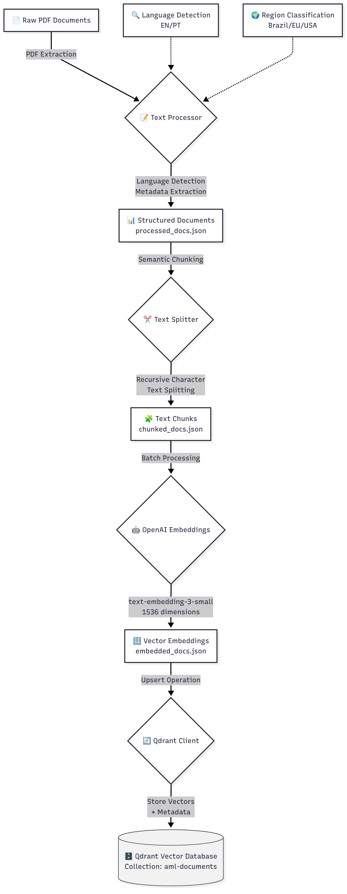

1.  **PDF Processing (`pdf_processor.py`):**
    *   Recursively scans the `docs/raw_docs` directory for PDF files.
    *   Extracts raw text content from each PDF.
    *   Detects the document's language (English/Portuguese) and source region (USA/EU/Brazil).
    *   Saves the processed text and metadata to `docs/processed_docs/processed_docs.json`.

2.  **Text Chunking (`text_splitter.py`):**
    *   Loads the processed documents.
    *   Uses a **Recursive Character Text Splitting** strategy to break down large documents into smaller, semantically coherent chunks (e.g., paragraphs, sentences).
    *   This ensures that the meaning and context are preserved for accurate embedding.
    *   Saves the chunked documents to `docs/processed_docs/chunked_docs.json`.

3.  **Embedding Generation (`openai_embeddings.py`):**
    *   Loads the text chunks.
    *   Uses OpenAI's `text-embedding-3-small` model to convert each chunk into a 1536-dimension vector embedding.
    *   Processes chunks in batches to efficiently interact with the OpenAI API.
    *   Saves the documents with their corresponding embeddings to `docs/embeddings/embedded_docs.json`.

4.  **Vector DB Storage (`qdrant_client.py`):**
    *   Loads the embedded documents.
    *   Connects to the **Qdrant** vector database.
    *   Creates a collection named `regulatory-docs`.
    *   Uploads (upserts) the vector embeddings along with their metadata (filename, language, source region, etc.) into the collection.

### Vector Database Results

Once the pipeline is complete, you can visualize your populated vector database through the Qdrant dashboard:

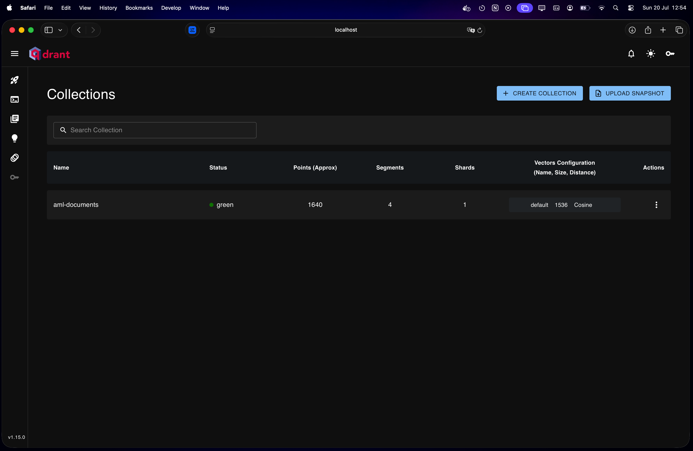

*The Qdrant dashboard showing our `regulatory-docs` collection with embedded regulatory content*

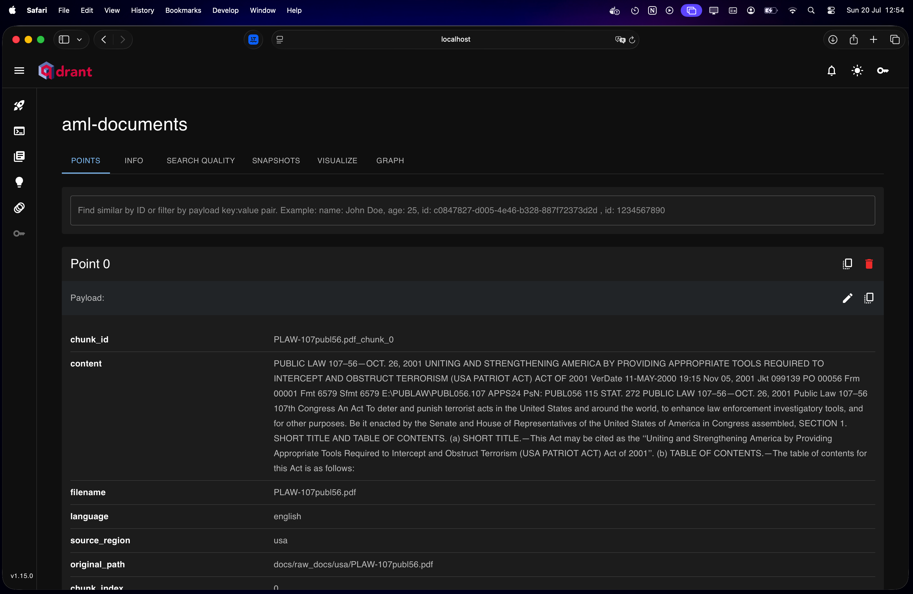

*Detailed view of the AML documents collection with vector embeddings and metadata*

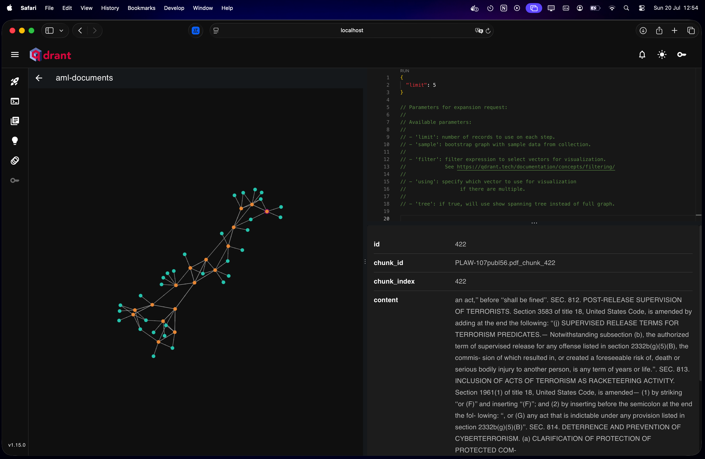

*Vector space visualization showing the semantic relationships between document chunks*

---

### RAG System Workflow

Once the vector database is populated, the RAG system handles user queries through the following intelligent workflow:

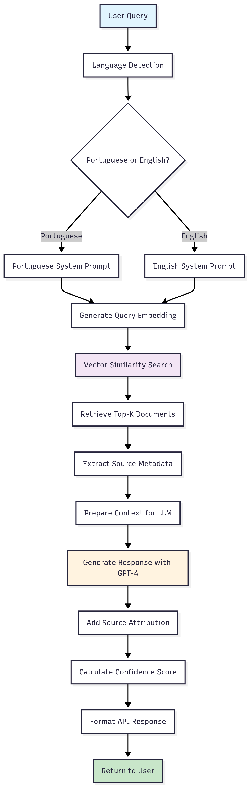

**RAG System Process:**

1. **Query Reception & Language Detection**: Analyze incoming query to determine language (Portuguese/English)
2. **Embedding Generation**: Convert query text into vector representation using OpenAI embeddings
3. **Vector Search**: Perform semantic similarity search in Qdrant to find relevant document chunks
4. **Context Preparation**: Extract and format retrieved documents with metadata (filename, jurisdiction, language)
5. **Answer Generation**: Use GPT-4 with language-appropriate system prompts and retrieved context
6. **Response Enhancement**: Add source citations, confidence scores, and jurisdiction identification
7. **API Response**: Format and return structured response with answer, sources, and metadata

## Advanced Features

### 1. 📊 Advanced Document Analysis
- **Topic Extraction**: Identifies key topics and themes across regulations
- **Requirement Mapping**: Maps requirements by jurisdiction and category
- **Cross-Reference Analysis**: Finds relationships between different regulations
- **Regulatory Timeline**: Tracks the evolution of requirements over time


*Document analysis process showing topic extraction, requirement mapping, and timeline analysis*

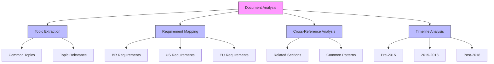

### 2. 🎯 Structured Response Generation
- **Multi-jurisdictional Analysis**: Compares requirements across jurisdictions
- **Source Attribution**: Detailed citation of regulatory sources
- **Confidence Scoring**: Weighted scoring based on source quality
- **Key Points Extraction**: Highlights critical requirements and obligations


*Structured response generation showing analysis components and source attribution*

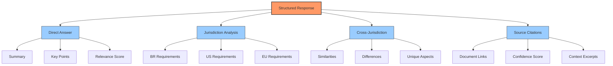

### 3. 📝 Document Summarization
- **Jurisdiction-based Summaries**: Concise overviews by jurisdiction
- **Topic-based Summaries**: Cross-jurisdictional summaries by topic
- **Requirement-based Summaries**: Focused summaries of specific obligations
- **Chronological Summaries**: Timeline-based regulatory evolution

### 4. 🔍 Regulatory Conflict Detection
- **Requirement Conflicts**: Identifies conflicting obligations
- **Definition Conflicts**: Highlights varying interpretations
- **Procedure Conflicts**: Spots procedural inconsistencies
- **Timeline Conflicts**: Detects deadline and timing conflicts


*Conflict detection process showing different types of regulatory conflicts*

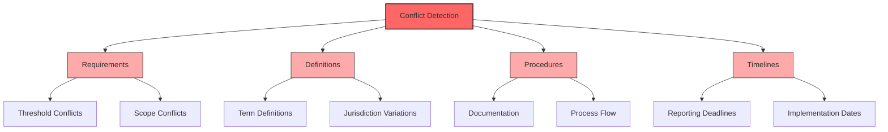

### 5. 📈 Regulatory Trend Analysis
- **Requirement Evolution**: Tracks changes in regulatory requirements
- **Focus Area Shifts**: Identifies emerging regulatory priorities
- **Stringency Analysis**: Monitors regulatory strictness changes
- **Pattern Recognition**: Identifies common regulatory patterns


*Trend analysis showing evolution of requirements and emerging patterns*

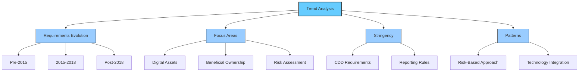

## Technology Stack
*   **Programming Language:** Python 3.11+
*   **Vector Database:** [Qdrant](https://qdrant.tech/)
*   **AI/LLM Frameworks:** LangChain, OpenAI
*   **Containerization:** Docker
*   **Package Management:** uv

## Setup and Installation

### Prerequisites
*   Python >= 3.11
*   Docker Desktop
*   An OpenAI API Key

### Installation Steps
1.  **Clone the repository:**
    ```bash
    git clone https://github.com/gregorizeidler/RegRAG.git
    cd RegRAG
    ```

2.  **Install uv (if not already installed):**
    ```bash
    # On macOS/Linux
    curl -LsSf https://astral.sh/uv/install.sh | sh
    
    # Or using Homebrew on macOS
    brew install uv
    ```

3.  **Create virtual environment and install dependencies:**
    ```bash
    # Create virtual environment and install exact dependency versions from lock file
    uv sync
    
    # Activate virtual environment
    source .venv/bin/activate  # On macOS/Linux
    # .venv\Scripts\activate   # On Windows
    ```
    
    > **Note:** The `uv sync` command reads the `uv.lock` file to install exact versions of all dependencies, ensuring reproducible builds across different environments.

4.  **Set up your environment variables:**
    ```bash
    # Copy the example environment file
    cp .env.example .env
    ```
    
    Then edit the `.env` file and add your OpenAI API key:
    ```env
    OPENAI_API_KEY="your_openai_api_key_here"
    ```

### Docker Setup for Qdrant
We use Docker to run the Qdrant vector database because it provides a consistent, isolated, and easy-to-manage environment.

1.  **Start the Qdrant Container:**
    This command will download the Qdrant image and start the database server. Your data will be persisted in a `qdrant_storage` folder in your project directory.
    ```bash
    docker run -d \
      --name qdrant-aml \
      -p 6333:6333 \
      -p 6334:6334 \
      -v $(pwd)/qdrant_storage:/qdrant/storage \
      qdrant/qdrant
    ```

2.  **Access the Qdrant Web UI:**
    You can explore your vector database through a graphical interface by navigating to the following URL in your browser:
    *   **URL:** [http://localhost:6333/dashboard](http://localhost:6333/dashboard)

## Running the Document Ingestion Pipeline
Execute the following scripts in order from the project root directory to process your documents and populate the vector database.

1.  **Process PDFs:**
    ```bash
    python3 -m backend.services.document_processing.pdf_processor
    ```

2.  **Chunk Documents:**
    ```bash
    python3 -m backend.services.document_processing.text_splitter
    ```

3.  **Generate Embeddings:**
    ```bash
    python3 -m backend.services.embeddings.openai_embeddings
    ```

4.  **Store in Vector Database:**
    ```bash
    python3 -m backend.services.vector_db.qdrant_client
    ```

After completing these steps, your vector database will be populated and ready for the RAG system.

## RAG System

The RegRAG Agent provides intelligent querying capabilities over the processed regulatory documents. The system combines vector similarity search with OpenAI's language models to deliver accurate, contextual responses with proper source attribution.

### Core Features

- **Multi-jurisdictional Intelligence**: Handles queries across US, EU, and Brazilian regulations
- **Semantic Search**: Vector-based similarity search for relevant document chunks
- **Language Detection**: Automatically detects Portuguese and English queries
- **Source Attribution**: Every response includes source documents and confidence scores
- **Real-time Processing**: Instant responses to complex compliance queries

### Live API Documentation

The system provides a FastAPI-based REST API with automatic documentation via Swagger UI:

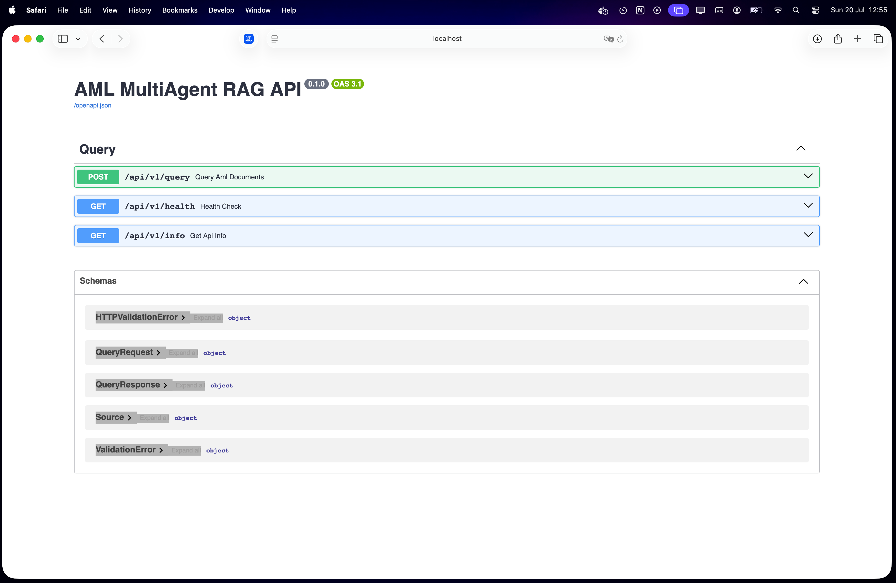

*Interactive API documentation for testing queries in real-time*

### API Endpoints

- **`POST /api/v1/query`** - Submit AML compliance questions
- **`GET /api/v1/health`** - Check system health and agent status  
- **`GET /api/v1/info`** - Get API capabilities and documentation

### Query Examples

The RAG agent can handle complex compliance questions across different jurisdictions:

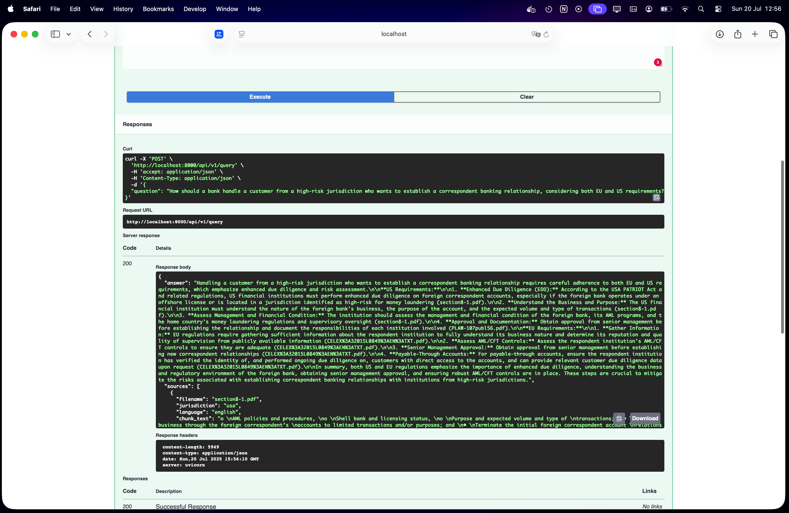

*Example response showing source attribution, confidence scoring, and jurisdiction identification*

**Sample English Queries:**
```
"What are the customer identification program (CIP) requirements under the USA PATRIOT Act?"
"How do enhanced due diligence measures differ between US and EU regulations?"
```

**Sample Portuguese Queries:**
```
"Quais são os procedimentos de conhecimento do cliente exigidos pelo Banco Central do Brasil?"
"O que estabelece a Circular 4001 sobre clientes de alto risco?"
```

## Running the Complete System

### **Start the API Server**
```bash
# Activate virtual environment
source .venv/bin/activate

# Start the FastAPI server
python3 -m uvicorn backend.api.main:app --reload --host 0.0.0.0 --port 8000
```

### **Access the Interface**
- **API Documentation**: [http://localhost:8000/docs](http://localhost:8000/docs)
- **Qdrant Dashboard**: [http://localhost:6333/dashboard](http://localhost:6333/dashboard)

## Future Roadmap

- Integrate multi-agent coordination to enrich responses.
- Build front-end interface


## License

This project is licensed under the MIT License. See the [LICENSE](LICENSE) file for details.
